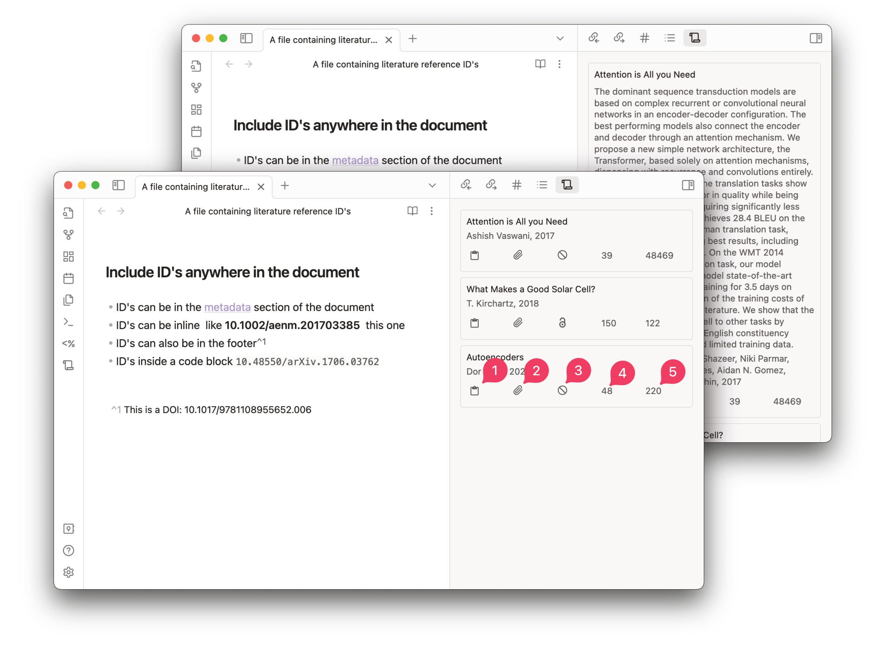

# Reference Map
Reference and citation map for literature review and discovery. 

## Requirements
- [Obsidian](https://obsidian.md/) with community plugins enabled

## Installation
The plugin is not available in the community plugin section in Obsidian. So you have to install it manually.

### Manual Installation
1. Download the latest release from [here](https://github.com/anoopkcn/obsidian-reference-map/releases) and unzip it.
2. Copy the `obsidian-reference-map` folder to your vault's `.obsidian/plugins` folder.
3. Reload Obsidian.
4. Enable the plugin in the community plugins section.

You can also use the [BRAT](https://github.com/TfTHacker/obsidian42-brat/) plugin to install the latest release.

## Features
- [x] Identifies research literature ID's from the current document and displays a map of references and citations. 
- [x] Copy metadata and BibTex to the clipboard.
- [x] Open PDF if available
- [x] Open paper in [Semantic Scholar](https://www.semanticscholar.org/)
- [x] Open the author's details in [Semantic Scholar](https://www.semanticscholar.org/)
- [x] List citations
- [x] List references
- [x] Search references and citations list
- [ ] Sorting of references and citations
- [ ] Get references via keywords of the paper
- [ ] Get references via the author's name
- [ ] On hover popover to show details of the reference
- [ ] Create notes from listed references and citations
- [ ] Graph view of connected references and citations

**NOTE**: Papers are ordered according to the publish date.

## Usage
- Click on the title of the paper to open the paper in [Semantic Scholar](https://www.semanticscholar.org/)
- Click on the author's name to open the author's details in [Semantic Scholar](https://www.semanticscholar.org/)
- Button functions:

    (1) Copy `BibTex` to the clipboard

    (2) Copy the `title`, `authors`, `year`, `abstract`, etc. to the clipboard

    (3) Click to open PDF if [Open Access](https://de.wikipedia.org/wiki/Open_Access) PDF is present for a reference

    (4) Click to open a list of all cited papers (References)

    (5) Click to open a list of all citing papers (Citations)

### Configuration 
    
Check out the settings tab to configure the plugin behaviour.

If you want to configure the style of the view you can use the [Obsidian-style-settings](https://github.com/mgmeyers/obsidian-style-settings) plugin.

## Paper IDs can be the following:
The following types of IDs are supported:
- `corpus:<id>` - Semantic Scholar numerical ID, e.g. `corpus:215416146`
- `DOI:<doi>` - a [Digital Object Identifier](http://doi.org/), e.g. `DOI:10.18653/v1/N18-3011`
- `ARXIV:<id>` - [arXiv.rg](https://arxiv.org/), e.g. `ARXIV:2106.15928`
- `MAG:<id>` - Microsoft Academic Graph, e.g. `MAG:112218234`
- `PMID:<id>` - PubMed/Medline, e.g. `PMID:19872477`
- `PMCID:<id>` - PubMed Central, e.g. `PMCID:2323736`
- `URL:<url>` - URL from sites, e.g. `URL:https://arxiv.org/abs/2106.15928v1`
- You can enable reference search using the markdown note filename in the settings. 
