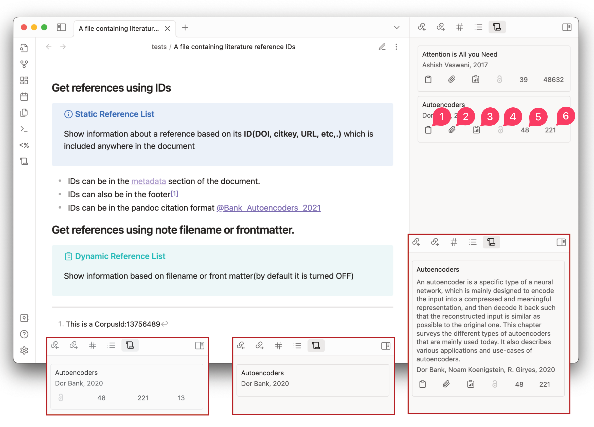
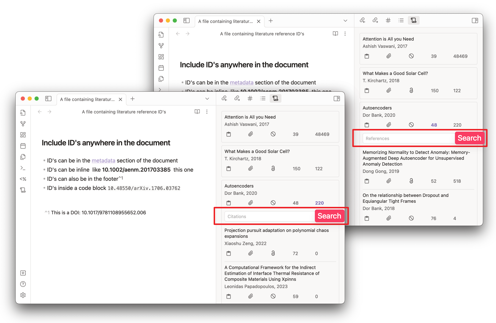

# Reference Map
Reference and citation map for literature review and discovery. 

## Requirements
- [Obsidian](https://obsidian.md/) with community plugins enabled

## Installation
The plugin is not yet available in the community plugin section in Obsidian. **So you have to install it manually.**

When published, it will be available in Obsidian's Community Plugin Tab via: Settings → Community Plugins → Browse → Search for "Reference Map"

### Manual Installation
1. Download the latest release from [here](https://github.com/anoopkcn/obsidian-reference-map/releases) and unzip it.
2. Copy the `obsidian-reference-map` folder to your vault's `.obsidian/plugins` folder.
3. Reload Obsidian.
4. Enable the plugin in the community plugins section.

You can also use the [BRAT](https://github.com/TfTHacker/obsidian42-brat/) plugin to install the latest release.

## Usage


### Reference Map View
Reference Map View contains Index cards and Reference Cards.

**Index Cards** are detected from the markdown document using ID's(see the *Static Reference List* section below)

**Reference Cards** show a searchable and sortable list of cited and citing papers of a reference contained in the index card. 

Each Index/Reference card in the view will show the following information:
|Button| Section | Description | On Click |
|---| --- | --- | --- |
|text| Title | Title of the paper | Open the paper in [Semantic Scholar](https://www.semanticscholar.org/) |
|text| Authors | Authors of the paper | Open the author's details in [Semantic Scholar](https://www.semanticscholar.org/) |
|| Year | Year of publication | -  |
|| Abstract | Abstract of the paper (Default=OFF) | -  |
|(1)| Metadata copy | User defined format of metadata. Default=`bibtex` of the paper | Copy the `<bibtex>` to the clipboard (If Batch copy is enabled it will copy `<bibtex>` for all the cited paper) |
|(2)| Metadata copy | User defined format of metadata Default=Formatted `metadata` details | Copy the `<metadata>` to the clipboard (If Batch copy is enabled it will copy `<metadata>` for all the cited paper) |
|(3)| Metadata copy | User defined format of metadata
 Default=Reference title as `wikilink` (Default=OFF)  | Copy the `<wikilink>` to the clipboard (If Batch copy is enabled it will copy `<wikilink>` for all the cited paper) |
|(4)| PDF | Open Access PDF of the paper | Open the [Open Access](https://de.wikipedia.org/wiki/Open_Access) PDF of the paper if it is present for a reference |
|(5)| Reference count | Number of references | Open a searchable list of all cited papers (References) |
|(6)| Citation count | Number of citations | Open a searchable list of all citing papers (Citations) |
|| Influential citation count  | [Number of influential citations](https://www.semanticscholar.org/paper/Identifying-Meaningful-Citations-Valenzuela-Ha/1c7be3fc28296a97607d426f9168ad4836407e4b) (Default=OFF) | - |

*You can customize the content of metadata copy buttons(1,2,3) in the settings, possible variables for the metadata template are listed in the settings description*

*Batch operations are exclusive to Index Cards*



### Static Reference List
Reference IDs (DOI, arxiv, corpusID, URL, citeKey, etc,.) that are found in the current document are listed in the `Reference Map` view. Valid IDs can be added anywhere in the document and they will be detected.

The following types of IDs are supported:
| ID Syntax | Descrtipion | Example |
| --- | --- | --- |
`DOI:<doi>` | A [Digital Object Identifier](http://doi.org/). |`DOI:10.18653/v1/N18-3011` or `10.18653/v1/N18-3011v1`
`@<citekey>`| [Zotero](https://www.zotero.org/) citekey* |`@smith2019attention`
`ARXIV:<id>`| [arXiv.org](https://arxiv.org/)|`ARXIV:2106.15928`
`MAG:<id>` | Microsoft Academic Graph|`MAG:112218234`
`PMID:<id>`| PubMed/Medline|`PMID:19872477`
`PMCID:<id>`| PubMed Central|`PMCID:2323736`
`URL:<url>`| URL from sites|`URL:https://arxiv.org/abs/2003.05991`
`CorpusId:<id>` | Semantic Scholar numerical ID|`CorpusId:215416146`


*Enable this feature from the settings. Note that, one has to provide a `Better BibTex CSL JSON` or `Bibtex CSL JSON` or `CSL JSON` file to enable this feature. Once enabled, the plugin can recogonize the pandoc citation format.
 

### Dynamic Reference List
The Reference Map view can also be configured to show a list of references that correspond to the filename of the note or frontmatter keywords. 
*Check out the settings tab to configure the plugin behaviour*

**Example:** For a file named `Attention is all you need.md`  cards will be displayed for references that match `Attention+all+need`. 

For frontmatter keywords, you can configure a keyword to be used for reference search.  By default, the keyword is `keywords`.

**Example:** For a frontmatter given as follows:
```
---
keywords: autoencoders, machine learning
---
```
Cards will be displayed for references that match `autoencoders+machine+learning`.

Note that since new references are added to the database regularly the dynamic list might not stay the same each time you open the file. Especially for generic keywords like `machine learning`, `deep learning`, `history` etc.

**This feature can be used for keeping up to date with the latest research in a specific field as well**

## Configuration 
    
If you want to configure the style of the view you can use the [Obsidian-style-settings](https://github.com/mgmeyers/obsidian-style-settings) plugin.

The settings tab contains options to configure the behaviour of the plugin.

### Please feel free to open an issue if you find any bugs or have any suggestions.